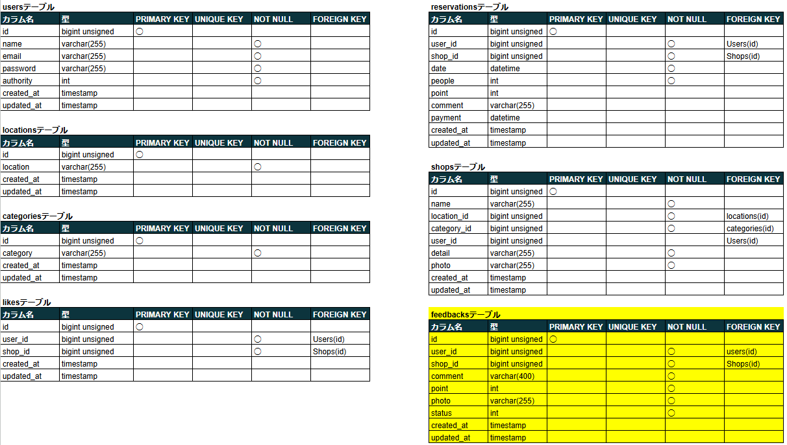
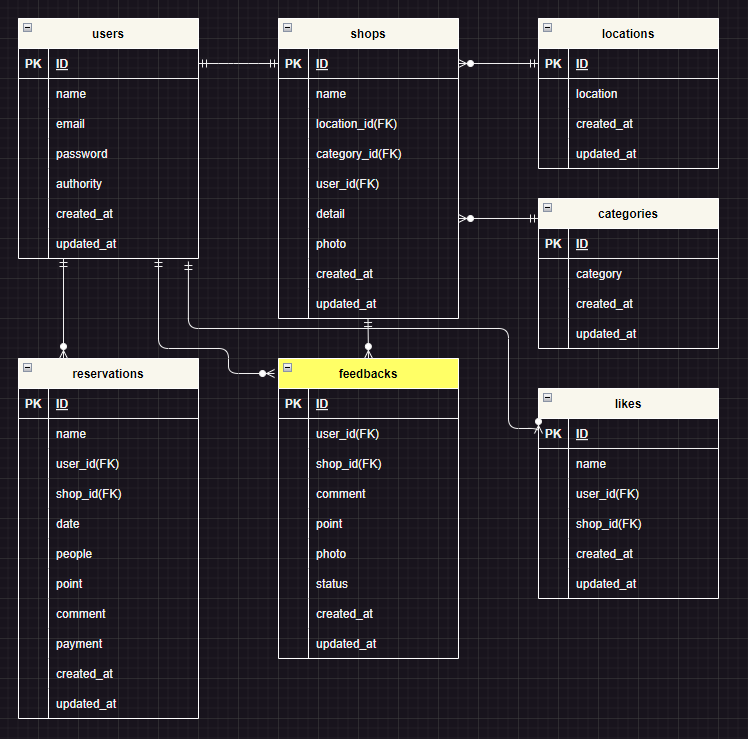

# アプリケーション名

- Rese（リーズ）
- 飲食店予約サービス

# 作成した目的

- 外部の飲食店予約サービスは手数料を取られるので自社で予約サービスを持ちたい。

# 機能一覧

- 会員登録
- メールによる 2 要素認証
- ログイン
- ログアウト
- マイページ表示
- 飲食店予約 追加・変更・削除(会員)
- 飲食店お気に入り 追加・削除(会員)
- 飲食店口コミ評価(会員)
- 過去の飲食店予約履歴表示(会員)
- 飲食店一覧表示
- 飲食店口コミ一覧表示
- 飲食店 エリア・ジャンル・キーワード検索
- 店舗代表者作成(管理者)
- 店舗情報 作成・変更(店舗代表者)
- 店舗予約情報確認(店舗代表者)
- 会員へのメール送信(管理者)
- 予約リマインド機能
  (予約当日の朝 7：00 に会員に対して、
  予約情報および来店した際に
  店舗側に見せる QR コードリマインドメールを送る)
- 事前決済機能
  (会員は予約した店舗に対して、
  一律 1,000 円の事前クレジットカード決済ができる)
  <!-- Pro入会テストにて追加 -->
- 口コミ投稿・編集・削除
  　(会員は自身が投稿した口コミの編集・削除が可能)
  　(管理者は全ユーザーの口コミ削除が可能)
- 店舗一覧ソート機能
  　(ランダム・評価の高い順・評価の低い順に並び替え可能)
- csv インポートによる店舗情報 作成(管理者)

# 使用技術(実行環境)

- PHP 7.4.9
- Laravel 8.83.27
- MySQL 8.0.26
- nginx 1.21.1

# テーブル設計

<!-- Pro入会テストにて修正 -->



# ER 図

<!-- Pro入会テストにて修正 -->



# 環境構築

**Docker ビルド**

1. `git clone git@github.com:ueppa0716/advance-test.git`
2. DockerDesktop アプリを立ち上げる
3. `docker-compose up -d --build`

**Laravel 環境構築**

1. `docker-compose exec php bash`
2. `composer install`
3. 「.env.example」ファイルを 「.env」ファイルに命名を変更。または、新しく.env ファイルを作成
4. .env に以下の環境変数を追加

```text
DB_CONNECTION=mysql
DB_HOST=mysql
DB_PORT=3306
DB_DATABASE=laravel_db
DB_USERNAME=laravel_user
DB_PASSWORD=laravel_pass
```

5. アプリケーションキーの作成

```bash
php artisan key:generate
```

6. マイグレーションの実行

```bash
php artisan migrate
```

7. シーディングの実行

```bash
php artisan db:seed
```

8. パブリックにアクセス可能なディレクトリへのシンボリックリンクを作成

```bash
php artisan storage:link
```

<!-- Pro入会テストにて追加 -->

# csv インポートによる店舗情報 作成

管理者は csv をインポートすることで、店舗情報を追加することが可能

csv ファイルの 1 行目は name,location_id,category_id,detail,photo と記載し、
2 行目からはそれぞれのデータをカンマで区切りながら下記注意事項に気を付けながら記載していく

- 項目は全て入力必須
- 店舗名：50 文字以内
- 地域：「東京都」「大阪府」「福岡県」のいずれかで入力
- ジャンル：「寿司」「焼肉」「イタリアン」「居酒屋」「ラーメン」のいずれかで入力
- 店舗概要：400 文字以内
- 画像 URL：jpeg、png のみアップロード可能。

(例)

```csvファイル
name,location_id,category_id,detail,photo
あいうえお店,大阪府,焼肉,東京の人気店が大阪にオープンしました,https://～
```
